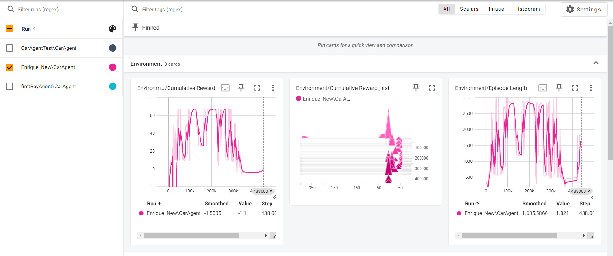

# WoopeeWarriorRacing

## Inleiding
Stap in de wereld van Woopée Warrior Racing, de baanbrekende VR-racegame die je meeneemt naar adembenemende circuits vol actie en snelheid. In deze futuristische racegame zit je als speler in de cockpit van een hypermoderne raceauto, waar je het opneemt tegen geavanceerde machine learning agents die zijn ontworpen om je rijvaardigheden tot het uiterste te testen.
### Samenvatting
Elke race is een intense strijd om de overwinning, waarbij je reflexen en strategisch inzicht op de proef worden gesteld. Met verschillende uitdagende tracks die variëren van snelle stadscircuits tot verraderlijke bergwegen, biedt Woopée Warrior Racing een meeslepende ervaring die je keer op keer doet terugkeren voor meer. Bereid je voor op de race van je leven en word de ultieme Woopée Warrior!

## Methoden

### Installatie

Installatie: 2022.3.10f1

### Verloop van spel
Wanneer je Woopée Warrior Racing start, kom je op een prachtige UI terecht die je direct onderdompelt in de race-ervaring. Hier kun je verschillende keuzes maken om je race voor te bereiden:

1) Kies je auto:
    - Selecteer je favoriete auto.
    - Personaliseer de kleur van je auto.

2) Kies je track:
    - Voorlopig heb je keuze uit twee uitdagende tracks.

3) Pas je settings aan:
    - Stel je audio-instellingen naar wens in.
    - Kies je gebruikersnaam.

Als je tevreden bent met je keuzes, druk je op Continue. Je wordt dan naar de geselecteerde track gebracht in de gekozen auto. Je hebt zelf de volledige controle over de auto in VR alsof je een echte racer bent. Je zal moeten sturen, gas geven en remmen om de finish te bereiken.

Daarna begint de spanning te stijgen met een countdown. Zodra de countdown eindigt, ben je vrij om te racen tegen de verschillende ML Agents. Let op: als je de muren raakt, ga je 'dood' en verschijnt er een game over-scherm met een DNF (Did Not Finish).

Wanneer je de finish bereikt, krijg je je positie in de race te zien en is het spel afgelopen. Als je wint of finisht, zie je in de achtergrond feestvierende toeschouwers op de track, wat je overwinning extra speciaal maakt.

Bereid je voor op de ultieme race-ervaring en laat zien dat jij de beste Woopée Warrior bent!

    - Duidelijk overzicht van de observaties, mogelijke acties en beloningen
    - Beschrijving van de objecten
    - Beschrijvingen van de gedragingen van de objecten
    - Alle informatie van de one-pager
    - Indien van toepassing: waar jullie afwijken van de one-pager en waarom

## Resultaten
In het begin van ons ontwikkeltraject hadden onze ML-Agents moeite om goed te presteren. We hebben behoorlijk wat gesukkeld met de initiële aanpak. Ons oorspronkelijke idee was om waypoints op de tracks te plaatsen en de agents een array te geven met de locaties van de transforms van die waypoints. Het doel was simpel: de agents moesten zo snel mogelijk naar de locatie van de transforms rijden. Helaas bleek deze aanpak niet effectief en stuitten we op diverse problemen.

We ondervonden vooral problemen bij de bochten te nemen, de agent kon namelijk de bocht (de muren rond de bocht) niet zien en stootte hier telkens tegen aan, wat op een endEpisode leidde: 
<!--  -->

Daarna besloten we over te stappen op een andere benadering door gebruik te maken van RaycastPerception3D. We gaven de agents zowel de transform locations als de raycastperceptions om hen te helpen bij het navigeren. Deze combinatie bleek een stuk beter te werken, en onze agents werden merkbaar competenter in het volgen van de juiste route:

Om de prestaties verder te verbeteren, wilden we de agents sneller laten rijden. Dit bereikten we door een strafsysteem te implementeren: als een agent trager was dan zijn vorige keer, werd hij bestraft. Deze aanpak stimuleerde de agents om steeds efficiënter en sneller te worden, wat uiteindelijk leidde tot indrukwekkende resultaten op de verschillende tracks.

### tensorboard

De afbeelding die gebruikt wordt is van een agent die al standaardwerking had, toch merken we nog vele verschillen op kleine aanpassingen. Bij het analyseren van de tensorboard merken we op dat hij snel stijgt en dan ineens daalt, dit komt door aanpassingen aan het rewardsysteem. Bij deze training waren we ons aan het richten op het fine tunen van de agent, en waren we de reward zo aan het aanpassen dat de agent elke checkpoint moest halen. Dit had een duidelijk effect op de werking van onze agent.

De grafieken zijn dus zeer divers, dit komt door de snel lerende agent en de terugkomende aanpassingen om hem nog beter te maken. Desondanks de diversiteit in de grafieken waren we zeer tevreden met het resultaat.

## Conclusie

### Samenvatting

We hebben een single player VR racing game gemaakt, waarbij je kan racen tegen AI-bots.

Wat hebben we nu concreet verwezenlijkt?

We hebben een VR driving experience gebouwd waarbij je kan rijden a.d.h.v. je joysticks. In ons spel hebben we een agent gecreëerd die zich oriënteert met Raycast3D perception, en dus een mooie tegenstander vormt. Ten laatste hebben we een mooie UI gebouwd met leuke extra's om de speler een leuke game experience te bieden.

### Persoonlijke visie

De resulaten die we behaald hebben laten mooi zien dat we onze lessen konden samenbrengen in de praktijk en hierdoor een mooi spel konden realiseren. De mogelijke verbeteringen vinden vooral plaats in de ontwikkeling van de agent, en een paar kleine factoren in het spel. We hadden meerdere problemen met de originele werking van de agent zonder Raycast perception, dit hebben we dan later verandert wat een drastische impact op de vooruitgang die we boekten. 

## Bronvermelding

Nanousis Development. (n.d.). Pathfinding in Unity: Create a Basic Navigation System in C#. YouTube. Retrieved from https://www.youtube.com/watch?v=OQps_DfIep8&t=290s&ab_channel=NanousisDevelopment

mrPCoding. (n.d.). Unity 2D Pathfinding: Create a Simple Navigation System in C#. YouTube. Retrieved from https://www.youtube.com/watch?v=bWrvUHI9j5U&list=PLKGJF9yNkmQZ1fBMGUwSEBSjBaIYjgFSs&index=2

Unity Asset Store. (n.d.). Formula One Car. Retrieved from https://assetstore.unity.com/packages/3d/vehicles/land/formula-one-car-25693

Unity Asset Store. (n.d.). Environment Track: Lowpoly Cartoon Props Mobile Free. Retrieved from https://assetstore.unity.com/packages/3d/props/environment-track-lowpoly-cartoon-props-mobile-free-211494

Unity Asset Store. (n.d.). Simple Firework. Retrieved from https://assetstore.unity.com/packages/vfx/particles/simple-firework-217956

mrPCoding. (n.d.). Unity 2D Pathfinding: Create a Simple Navigation System in C#. YouTube. Retrieved from https://www.youtube.com/watch?v=bWrvUHI9j5U&ab_channel=mrPCoding

pabloslab. (n.d.). Unity: How to Create a Basic AI System. YouTube. Retrieved from https://www.youtube.com/watch?v=6Y1bAvRYqbU&list=PLhWBaV_gmpGXxscZr8PIcreyYkw8VlnKn&ab_channel=pabloslab

ChatGPT. (n.d.). Retrieved from https://chatgpt.com/

Unity Technologies. (n.d.). ML-Agents. GitHub. Retrieved from https://github.com/Unity-Technologies/ml-agents

Bing Videos. (n.d.). Unity ML Agents. Retrieved from https://www.bing.com/videos/riverview/relatedvideo?q=unity+ml+agents&mid=946C4E35C3F85352FC92946C4E35C3F85352FC92&FORM=VIRE

Unity Technologies. (n.d.). ML-Agents Overview. Retrieved from https://unity-technologies.github.io/ml-agents/ML-Agents-Overview/

