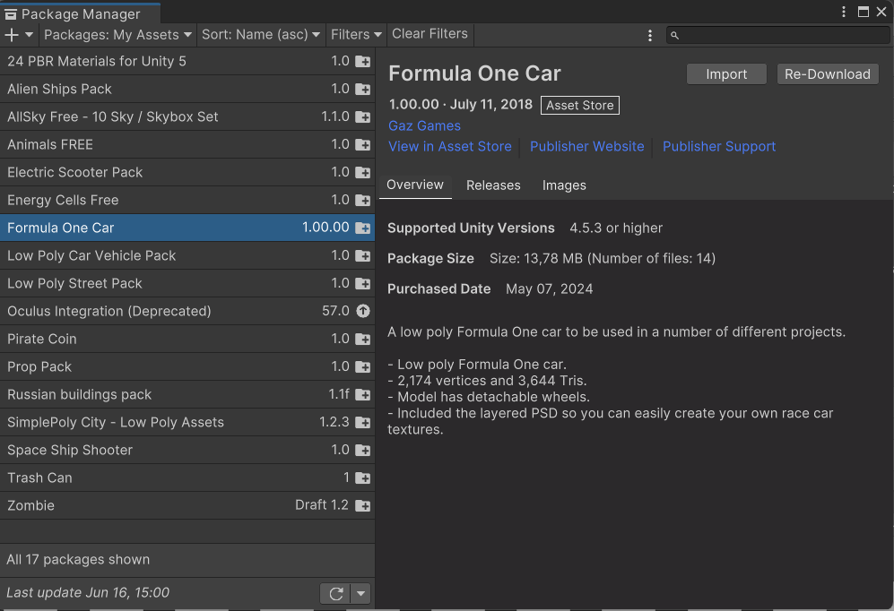
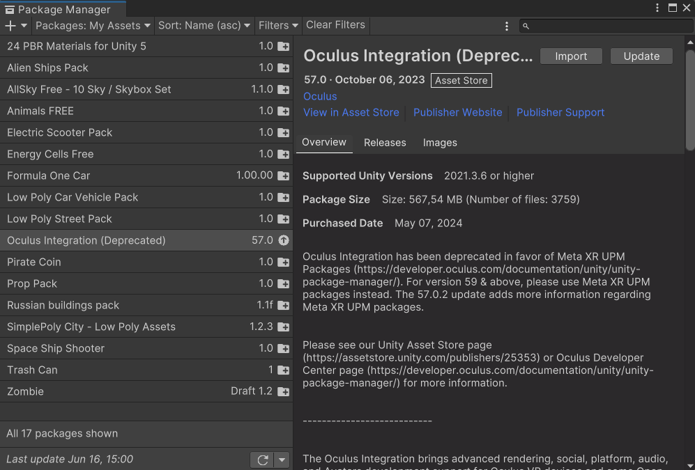
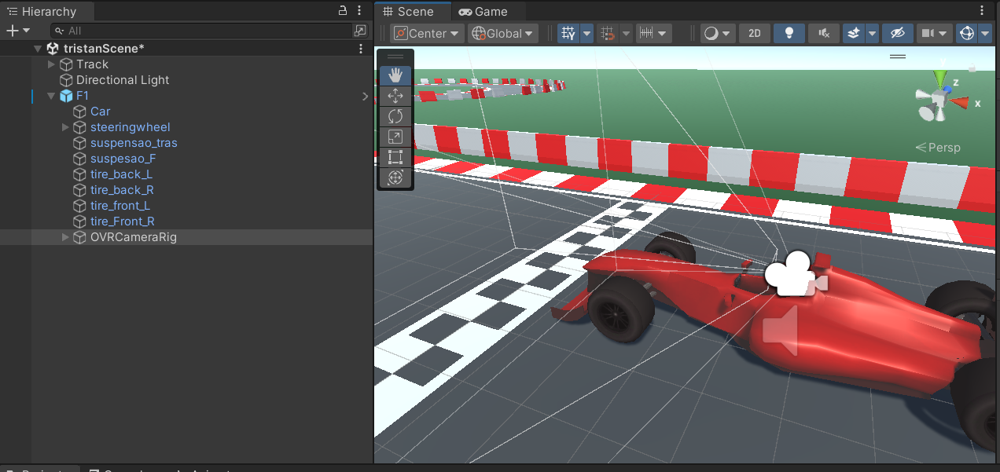
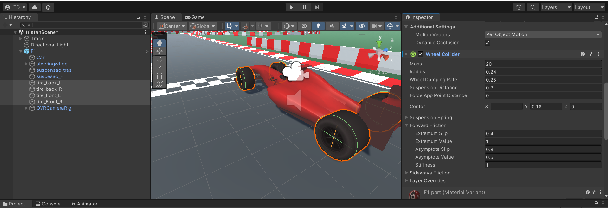
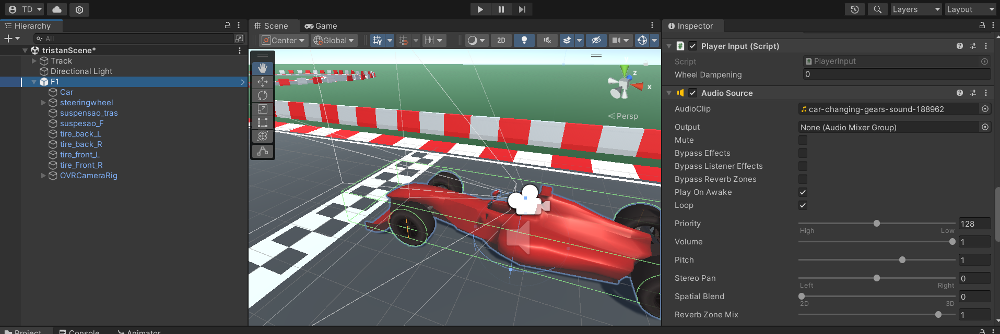

# tutorial controls vr
## assets
importeer de volgende assets: </br>


## setup
Maak een scene en import hierin een f1 prefab (Assets/F1/Prefab)</br>
Zet hier een RigidBody op </br>
Sleep nu de OVRCameraRig in de F1 prefab (Assets/Oculus/VR/Prefabs)</br>
Zet de camera mooi voor het stuur. </br>

Zet nu op alle 4 de wielen een wheel collider en zorg dat ze mooi op de buitenkant van de wielen staan: </br>
 </br>
kies tenslotte nog een mp3 car sound naar keuze. </br>
Zet op de F1 car nog een Audio source</br>

Dit is de basis setup van de auto. </br>
## scripts
We hebben 2 scripts: ControllCar en PlayerInput (benaming is belangrijk) </br>
### PlayerInput
```
using UnityEngine;

public class PlayerInput : MonoBehaviour
{
    public float Acceleration
    {
        get { return m_Acceleration; }
    }
    public float Steering
    {
        get { return m_Steering; }
    }
    public float Reverse
    {
        get { return m_Reverse; }
    }

    float m_Acceleration;
    float m_Steering;
    float m_Reverse;

    bool m_FixedUpdateHappend;

    private bool accelerating = false;
    private bool breaking = false;
    private bool reversing = false;
    private bool turningLeft = false;
    private bool turningRight = false;

    public float wheelDampening;

    private void Update()
    {
        GetPlayerInput();

        if (accelerating)
        {
            m_Acceleration = 1f;
            wheelDampening = 500f;
        }
        else if (breaking)
        {
            m_Acceleration = -0.5f;
            wheelDampening = 10000f;
        }
        else if (reversing)
        {
            m_Reverse = 1f;
            wheelDampening = 500f;
        }
        else
        {
            m_Acceleration = 0f;
            wheelDampening = 5f;
        }

        if (turningLeft)
        {
            m_Steering = -1f;

        }
        else if (!turningLeft && turningRight)
        {
            m_Steering = 1f;
        }
        else
        {
            m_Steering = 0f;
        }
    }
    private void GetPlayerInput()
    {
        if (OVRInput.GetDown(OVRInput.Button.PrimaryHandTrigger, OVRInput.Controller.RTouch))
        {
            reversing = true;
        }
        if (OVRInput.GetUp(OVRInput.Button.PrimaryHandTrigger, OVRInput.Controller.RTouch))
        {
            reversing = false;
        }

        if (OVRInput.GetDown(OVRInput.Button.PrimaryIndexTrigger, OVRInput.Controller.RTouch))
        {
            accelerating = true;
        }
        if (OVRInput.GetUp(OVRInput.Button.PrimaryIndexTrigger, OVRInput.Controller.RTouch))
        {
            accelerating = false;
        }

        if (OVRInput.GetDown(OVRInput.Button.PrimaryThumbstickDown, OVRInput.Controller.RTouch))
        {
            breaking = true;
        }
        if (OVRInput.GetUp(OVRInput.Button.PrimaryThumbstickDown, OVRInput.Controller.RTouch))
        {
            breaking = false;
        }

        if (OVRInput.GetDown(OVRInput.Button.PrimaryThumbstickLeft, OVRInput.Controller.RTouch))
        {
            turningLeft = true;
        }
        if (OVRInput.GetUp(OVRInput.Button.PrimaryThumbstickLeft, OVRInput.Controller.RTouch))
        {
            turningLeft = false;
        }

        if (OVRInput.GetDown(OVRInput.Button.PrimaryThumbstickRight, OVRInput.Controller.RTouch))
        {
            turningRight = true;
        }
        if (OVRInput.GetUp(OVRInput.Button.PrimaryThumbstickRight, OVRInput.Controller.RTouch))
        {
            turningRight = false;
        }
    }
}
```
### ControllCar
```
using System.Collections;
using System.Collections.Generic;
using UnityEngine;
using UnityEngine.InputSystem;

public class ControllCar : MonoBehaviour
{

    private PlayerInput inputManager;
    public List<WheelCollider> throttleWheels;
    public List<WheelCollider> steeringWheels;
    public float speed = 1200f;
    public float strengthCoefficient = 200000f;
    public float maxTurn = 20f;

    void Start()
    {
        inputManager = GetComponent<PlayerInput>();
    }

    void FixedUpdate()
    {
        foreach (WheelCollider wheel in throttleWheels)
        {
            if (inputManager.Acceleration > 0)
            {
                wheel.motorTorque = strengthCoefficient * Time.deltaTime * inputManager.Acceleration * speed;
            }
            else if (inputManager.Reverse > 0)
            {
                wheel.motorTorque = -strengthCoefficient * Time.deltaTime * inputManager.Reverse * speed;
            }
            wheel.wheelDampingRate = inputManager.wheelDampening;
        }


        foreach (WheelCollider wheel in steeringWheels)
        {
            wheel.steerAngle = maxTurn * inputManager.Steering;
            wheel.wheelDampingRate *= inputManager.wheelDampening;
        }
    }
}
```

## slot
Als dit allemaal in orde is zou je een rijdende auto moeten hebben die je kan besturen met je controller (gas, remmen, achteruit rijden, links en rechts sturen).
## Bronnen
https://www.youtube.com/watch?v=bWrvUHI9j5U&list=PLKGJF9yNkmQZ1fBMGUwSEBSjBaIYjgFSs&index=2
